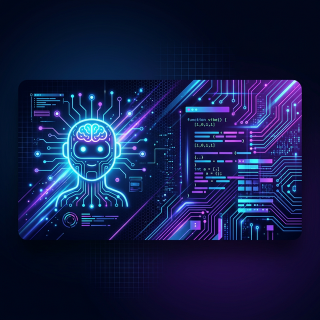

# ⚡ VibeToolkit: Domine o Vibe-Coding com Contexto Real

O **VibeToolkit** é o seu parceiro definitivo para programar com IAs (ChatGPT, Claude, Gemini). Ele elimina a "amnésia" dos modelos, consolidando seu projeto em um **Blueprint Inteligente** que permite à IA entender sua arquitetura, tecnologias e lógica instantaneamente.

> **Vibe-coding** é sobre focar na ideia e deixar a IA cuidar dos detalhes. Este toolkit garante que a IA saiba exatamente onde ela está pisando.

---

## 🎯 Arquitetura Orquestrador -> Executor

O VibeToolkit agora trabalha com o conceito de delegação técnica. O bundle gerado **não é** para ser executado diretamente. O fluxo correto é:
1. Você extrai o código escolhendo o **Executor Alvo** (AI Studio Apps ou Antigravity).
2. O bundle é colado em um **Orquestrador** (Gemini Web ou ChatGPT Web).
3. O Orquestrador analisa o contexto arquitetural e cospe um **Prompt Final** cirúrgico.
4. Você cola esse prompt final no **Executor** que fará a mudança no projeto real.

---

## ✨ Recursos Mágicos

* **🔍 Mapeamento Inteligente:** Varre suas pastas ignorando o lixo (`node_modules`, `dist`, etc) e focando no que importa.
* **🧠 Delegação Automática:** IA embutida (via Groq) já prepara o Prompt de Execução para você.
* **🖱️ Integração Nativa:** Clique com o botão direito em qualquer pasta e gere seu contexto em segundos.
* **📋 Auto-Copy:** Tudo o que o Orquestrador precisa já vai direto para a sua área de transferência. Paste & Go!

---

## 🛠️ Modos de Extração

Escolha a intensidade do contexto que você quer enviar:

| Modo | Estilo | Uso Ideal |
| --- | --- | --- |
| **[ 1 ] Full Vibe** | Tudo o que você escreveu. | Projetos pequenos ou bugs difíceis. |
| **[ 2 ] Architect** | Apenas as "assinaturas" (esqueleto). | Projetos gigantes, foco em estrutura. |
| **[ 3 ] Sniper** | Você escolhe arquivo por arquivo. | Focar em uma parte específica sem ruído. |

---

## 🚀 Instalando em 30 Segundos

1.  **Node.js:** Tenha o [Node.js](https://nodejs.org/) instalado.
2.  **Setup:** Clique com o botão direito no arquivo `setup-menu.ps1` e selecione **"Executar com o PowerShell"**.
3.  **API Key:** O script vai pedir sua chave da Groq (Grátis em [console.groq.com](https://console.groq.com)).
4.  **Pronto!** O menu de contexto será instalado automaticamente.

---

## 📖 Como Usar (O Fluxo Perfeito)

1.  Vá na pasta do seu projeto.
2.  **Botão Direito** > **"Gerar Blueprint / Contexto (Vibe AI)"**.
3.  Escolha o modo de extração (1, 2 ou 3).
4.  Escolha o **Executor Alvo** (1 para AI Studio Apps, 2 para Antigravity).
5.  Aguarde o processamento... **PLIM!** 6.  O conteúdo está no seu **Clipboard**. Cole no seu Orquestrador (Gemini/ChatGPT Web).
7.  Copie o Prompt Final gerado pelo Orquestrador e execute no seu Executor (AI Studio Apps/Antigravity).

---

## 💡 Dicas de Vibe-Coding

* **Sempre siga o pipeline:** Orquestradores são ótimos para pensar. Executores são ótimos para agir. Não inverta os papéis.
* **Use o Modo Inteligente em Monorepos:** Economize tokens enviando apenas as definições de tipos e interfaces ao Orquestrador.

---

*Desenvolvido para quem quer criar mais e configurar menos.* 🚀